# <a id="Top">Many Tuya Wireless switch Zigbee with custom firmware</a>

<!--  -->

---

> [!WARNING]
> Проект в разработке, выключатели будут добавляться. Пока только для ознакомления.
>
> **Автор не несет никакой ответственности, если вы, воспользовавшись этим проектом, превратите свой умный выключатель (выключатель) в полоумный.**

<!--
| Custom Zigbee Model | Original Zigbee Model | Z2M Model        | Original Zigbee Manufacturer      | Update method | Photo    |
|:-------------------:|:---------------------:|:----------------:|:---------------------------------:|:-------------:|:--------:|
| TS0041-M001-SlD     | TS0041                | TS0041           | _TZ3000_an5rjiwd            	     | OTA file      | :bookmark_tabs: |
| TS0041-M002-SlD     | TS0601 TS004F         | ZG-101Z ZG-101ZL | _TZE200_nojsjtj2 _TZ3000_ja5osu5g | OTA file      | :bookmark_tabs: |
-->

| Custom Zigbee Model | Original Zigbee Model | Z2M Model | Original Zigbee Manufacturer| Update method | Description |
|:-------------------:|:---------------------:|:---------:|:---------------------------:|:-------------:|:-----------:|
| TS0041-M001-SlD | TS0041 | [TS0041](https://www.zigbee2mqtt.io/devices/TS0041.html) | _TZ3000_an5rjiwd | OTA file | [:bookmark_tabs:](doc/TS0041-M001.md) |
| TS0041-M002-SlD | TS0601  TS004F | [ZG-101Z](https://www.zigbee2mqtt.io/devices/ZG-101Z.html)  [ZG-101ZL](https://www.zigbee2mqtt.io/devices/ZG-101ZL.html) | _TZE200_nojsjtj2  _TZ3000_ja5osu5g | OTA file  BIN file | [:bookmark_tabs:](doc/TS0041-M002.md)  [:bookmark_tabs:](doc/TS0041-M002_2.md) |
| TS0042-M003-SlD | TS0042 | [TS0042](https://www.zigbee2mqtt.io/devices/TS0042.html) | _TZ3000_h68nee3e | OTA file | [:bookmark_tabs:](doc/TS0042-M003.md) | 
| TS0044-M004-SlD | TS0044 | [TS0044](https://www.zigbee2mqtt.io/devices/TS0044.html) | HOBEIAN | BIN file | [:bookmark_tabs:](doc/TS0044-M004.md) |

#### Проверялся только в zigbee2mqtt. Требует всестороннего тестирования.

## Зачем. 

Расширение [проекта для LoraTap](https://github.com/slacky1965/tuya_battery_switch_ts004x_zed) до более универсальной прошивки, одной на многие выключатели.

## Как обновить. 

    
Раскрыть

С выходом новой версии `zigbee2mqtt` обновление стало в разы легче. 

Нужно только переключиться в новый интерфейс - `zigbee2mqtt-windfront`.

> [!WARNING]
> Внимание!!! На момент выхода прошивки конвертор не был добавлен в репозиторий `zigbee-herdsman-converters`, поэтому в этой версии `zigbee2mqtt` [внешний конвертор](zigbee2mqtt/TS0044-z-SlD.js) нужно положить в директорию `external_converters` и перегрузить `zigbee2mqtt`. В последующих версиях внешний конвертор будет не нужен.

Итак, скачиваем из репозитория нужный файл обновления (какой именно смотрите в таблице вверху). Заходим в устройство. И справа видим в `Firmware version` значок облака. Нам сюда.

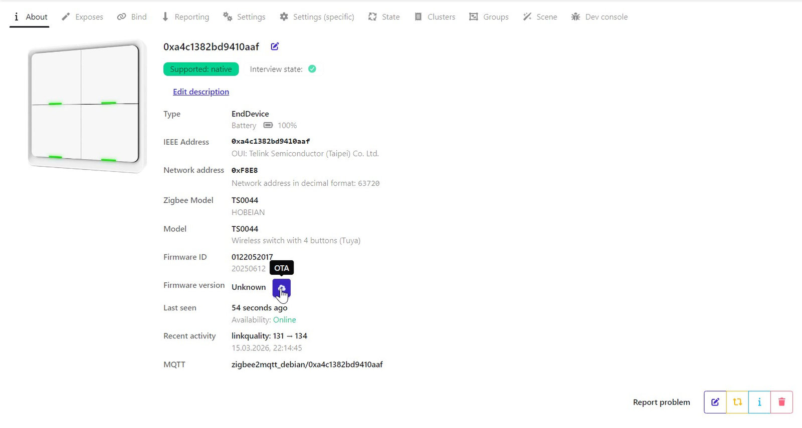

Далее выбираем `Custom firmware` из вываливающегося списка.

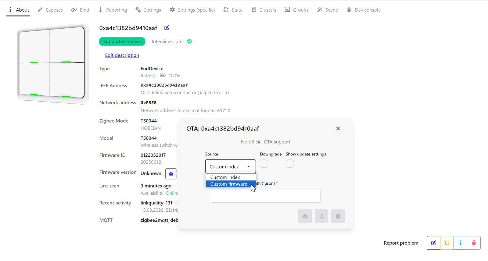

После этого выбираем файл.

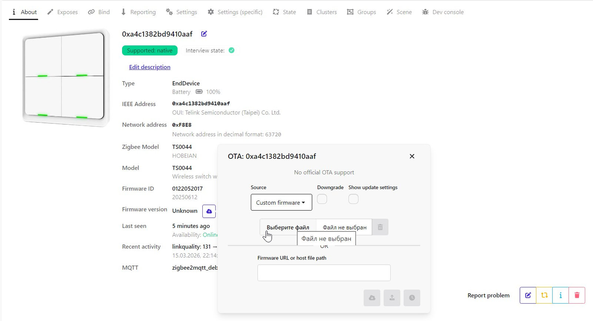

Далее нажимаем кнопку на выключателе, т.е. будим его и жмем обновить.

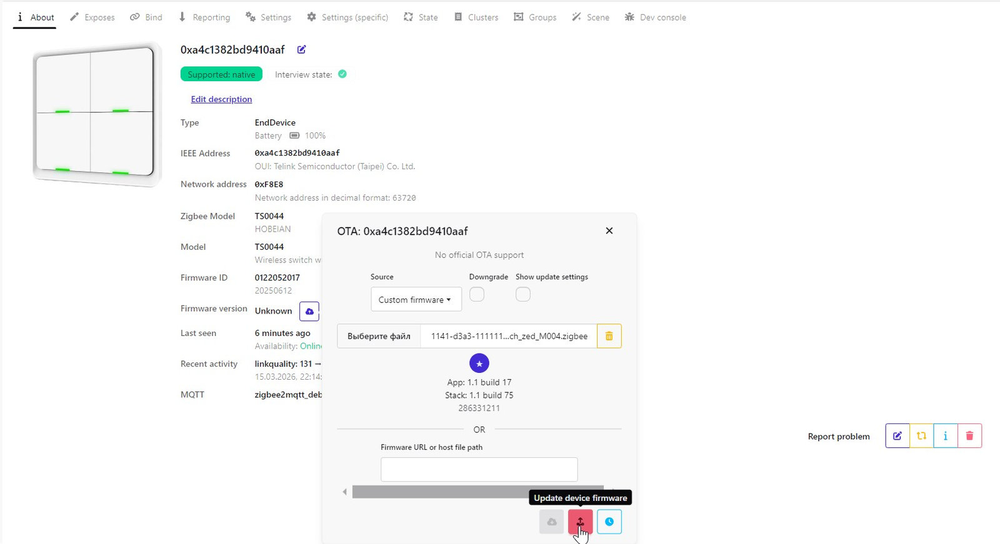

Чтобы понять, пошло обновление или нет, смотрим на изображение выключателя, там должен появиться вращающийся кружок со стрелками. И в `Recent activity` будет отображаться оставшееся время в секундах и сколько загрузили в процентах.

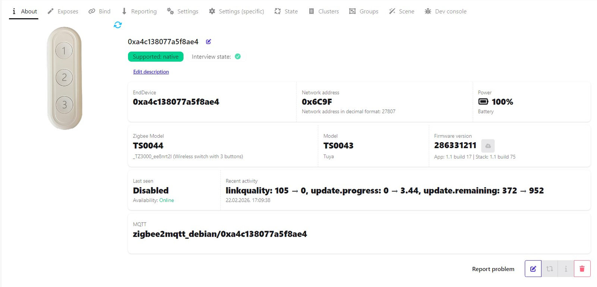

Ну и еще это все будет фиксироваться в логе.

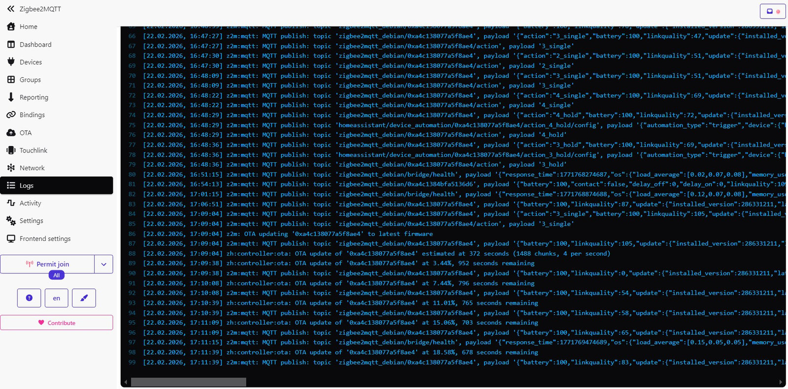

После завершения обновления выключатель готов к спариванию, нужно только разрешить это в `zigbee2mqtt`. Старую версию выключателя просто удаляем. 

   

   
> [!WARNING]
> Чтобы ввести выключатель в режим сопряжения, нужно 5 раз подряд нажать любую кнопку. Каждое нажатие будет сопровождаться вспышкой светодиода. После 5-го нажатия светодиод загорится на 3 секунды. За эти 3 секунды нужно успеть нажать кнопку и удерживать ее нажатой 1-2 секунды. Понять, вошел выключатель в режим сопряжения можно по моргающему светодиоду с частотой примерно 1 раз в секунду. Время, отведенное на сопряжение, не превышает полторы минуты. После чего светодиод прекращает моргать, а выключатель переходит в ждущий режим.

---

## Возможности.

### 1-но кнопочный выключатель

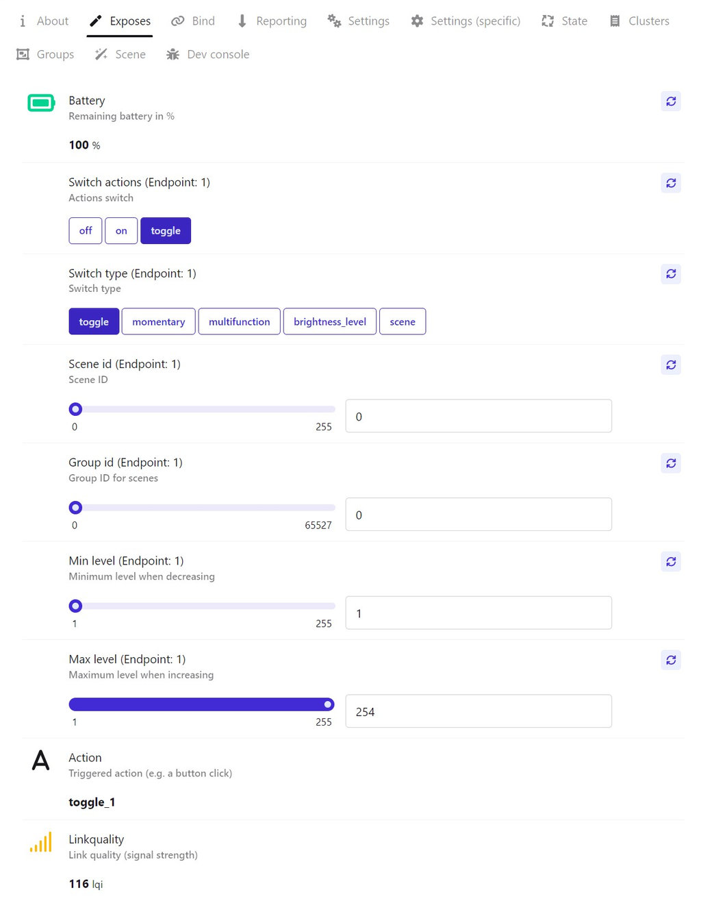

### Многокнопочный выключатель

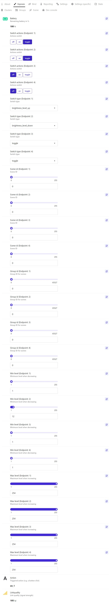

- `Battery` - заряд батарейки в процентах.
- `Switch actions (Endpoint: X)` - устанавливает, какую команду посылать `On`, `Off` или `Toggle` при `Switch Type` выбранным `toggle` или `momentery` (при других выбранных параметрах эта настройка игнорируется).
- `Switch type (Endpoint: X)` - выбор действия при нажатии на кнопку.
	- `toggle` - посылает команды `OnOff` при нажатии кнопки. Команда зависит от выбранной настройки `Switch actions (Endpoint: X)`. Если выбрана настройка `On`, то при нажатии всегда уходит команда `On`, если выбрана настройка `Off`, то при нажатии всегда уходит команда `Off`. С настройкой `toggle` - тоже самое.
	- `momentary` - посылает команды `OnOff` при нажатии и при отпускании кнопки. Команда зависит от выбранной настройки `Switch actions (Endpoint: X)`. Если выбрана команда `On`, то при нажатии уходит команда `On`, а при отпускании команда `Off`. Если выбрана настройка `Off`, то при нажатии уходит команда `Off`. Если выбрана настройка `toggle`, то команда `toggle` уходит и при нажатии, и при отпускании.
	- `multifunction` - высылает `actions` - 1 нажатие, 2 нажатия, 3 нажатия, удержание и отпускание кнопки.
	- `brightness_level` - устанавливает режим работы кнопки для попеременного увеличения и уменьшения яркости.
		- Одно нажатие - посылает команду `toggle` на устройство.
		- Удержание - посылает команду `Move to level`. `level` для команды берется из атрибута `minLevel` или `maxLevel`. Скорость увеличения/уменьшения яркости берется из атрибута `onOffTransitionTime`, который можно изменить через dev-консоль. По умолчанию это значение равно 25.
	- `brightness_level_up` (**доступно для многокнопочных выключателей**) - устанавливает режим работы кнопки для увеличения яркости.
		- Одно нажатие - посылает команду `On` на устройство.
		- Двойное нажатие - посылает команду `Step` на устройство (прибавляет к текущему значению яркости примерно 25 единиц). Если устройство выключено, оно включается (**для 1-но кнопочных версий это действие недоступно**).
		- Удержание - посылает команду `Move to level`. Устройство должно плавно увеличивать яркость, пока последняя не станет максимальной - значение максимальной яркости берется из атрибута `maxLevel`. Увеличение продолжается, пока удерживается кнопка. Если устройство было выключено, оно включается.
	- `brightness_level_down` (**доступно для многокнопочных выключателей**) - устанавливает режим работы кнопки для уменьшения яркости.
		- Одно нажатие - посылает команду `Off` на устройство.
		- Двойное нажатие - посылает команду `Step` на устройство (отнимает от текущего значения яркости примерно 25 единиц). Если устройство включено, а яркость достигла минимального предела, оно выключается.
		- Удержание - посылает команду `Move to level`. Устройство должно плавно уменьшать яркость, пока последняя не станет минимальной - значение минимальной яркости берется из атрибута `minLevel`. Уменьшение продолжается, пока удерживается кнопка. Устройство не выключается если яркость достигла минимального предела.
	- `scene` - работа со сценами. Сцены создаются в управляемом устройстве во вкладке `Scene` или в группе. При нажатии на кнопку посылается команда `Recall scene` на устройство или в группу.
- `Scene id (Endpoint: X)` - номер сцены (от `0` до `255`).
- `Group id (Endpoint: X)` - номер группы, если сцена была создана в группе (от `1` до `0xfff7`). Если сцена в группе не создавалась, это поле должно оставаться со значением `0`.
- `Min level` - значение, ниже которого яркость не может измениться.
- `Max level` - значение, выше которого яркость не может измениться.
- `Action` - показывает название присланных команд и атрибутов в символьном виде.

`(Endpoint: X)` - X - номер эндпоинта. Зависит от количества кнопок. Может быть от `1` до `6`. Соответственно и полей с настройками `Switch actions`, `Switch type`, `Scene id` , `Group id` тоже будет от `1` до `6`.

> [!WARNING]
> Для настройки каких-либо параметров выше, а так же репортинга, биндинга и прочего, прежде чем нажать в `Web`-интерфейсе подтверждение, нужно зажать любую кнопку и не отпускать ее, пока не придет подтверждение, что действие выполнено.

---

## Репортинг

Привычный репортинг есть только у бетарейки и все равно его пришлось немного модифицировать (в угоду сбережения заряда батарейки). Cчитывание показаний батарейки и отправка репорта зависят от настройки `Max rep interval`.

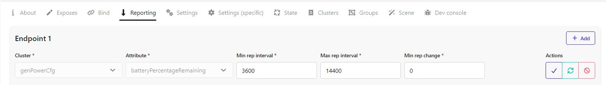

Если на выключателе не нажимать кнопки, то он уснет на время, указанное в параметре `Max rep interval`. Т.е. исходя из скриншота - на 14400 секунд, что соответствует 4-м часам. По истечению этого времени выключатель проснется, измерит батарейку, вышлет репорт и опять уснет на это же время. **Чтобы принудительно отправить репортинг батарейки, нужно 4 раза подряд нажать на любую кнопку.**

## Биндинг

Биндинг нужен для того, чтобы выключатель знал, куда именно ему нужно высылать команды. И если для команд `OnOff` достаточно прибиндить только кластер `genOnOff`, то для управления светом и яркость нужно забиндить уже два кластера - `genOnOff` и `genLevelCtrl`. Лампочки, как правило, являются роутерами, и поэтому связка пульт - лапочка при прямом биндинге должна работать, даже если будет какая-то проблема с сетью (например отключился координатор).

Также можно биндить не только конкретное устройство, но и целиком **`группу`**.

Также можно забиндить какое-нибудь устройство, которое поддерживает технологию `Find and bind`. Чтобы ввести выключаетль в режим поиска нужно 4 раза быстро нажать нужную кнопку и затем в течение 3 секунд нажать и удерживать эту же кнопку.

## Группы

Еще одна возможность управлять светом без настройки биндинга - это группы. Допустим мы настроили выключатель таким образом, что 2-я кнопка отвечает за включение и увеличения яркости, а 3-я за выключение и уменьшения яркости.

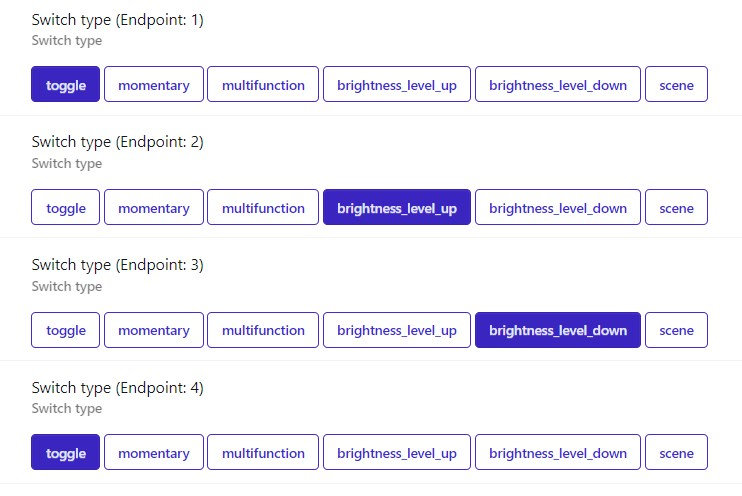

Для того, чтобы все работало без настройки биндинга, создаем группу с каким-нибудь именем и присваиваем ей номер, допустим `10`. Номер или `ID` этой группы также является ее сетевым групповым адресом. Теперь в эту группу добавляем `Endpoint 1` лампочки и `Endpoint 2`, `Endpoint 3` выключателя, где мы как раз настроили управление светом.

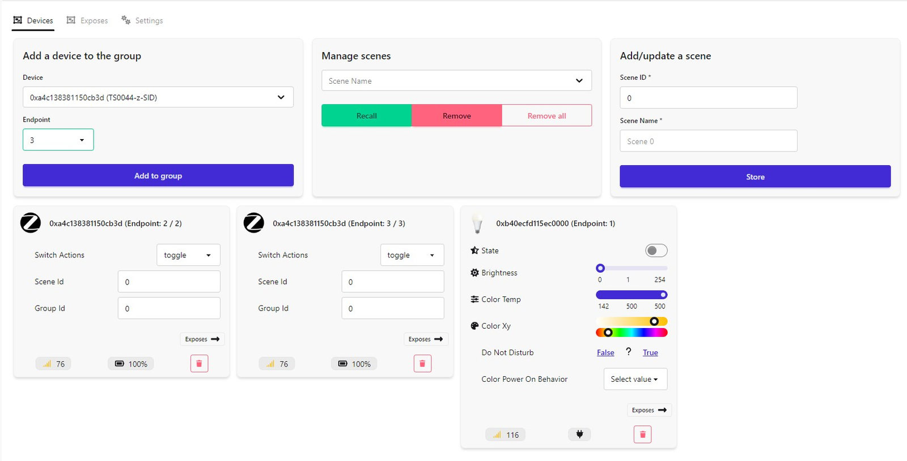

Все, больше никаких настроек не требуется. Теперь, если мы нажимаем на выключателе кнопку 2 или 3, лампочка начинает выполнять команды.

---

Связаться со мной можно в **[Telegram](https://t.me/slacky1965)**.

### Если захотите отблагодарить автора, то это можно сделать через [ЮMoney](https://yoomoney.ru/to/4100118300223495)

[Наверх](#Top)

- 1.0.01
	- Добвлена кнопка `_TZ3000_an5rjiwd`.
	- Добавлены кнопки `_TZE200_nojsjtj2` и `_TZ3000_ja5osu5g` .
- 1.0.02
	- Добавлен выключатель EKF `_TZ3000_h68nee3e` на 2 кнопки.
- 1.0.03
	- Добавлен выключатель `HOBEIAN` на 4 кнопки.
- 1.0.04
	- Добавлен выключатель `_TZ3000_itb0omhv` на 1 кнопку.
	- Добавлен функционал `Find and bind`.